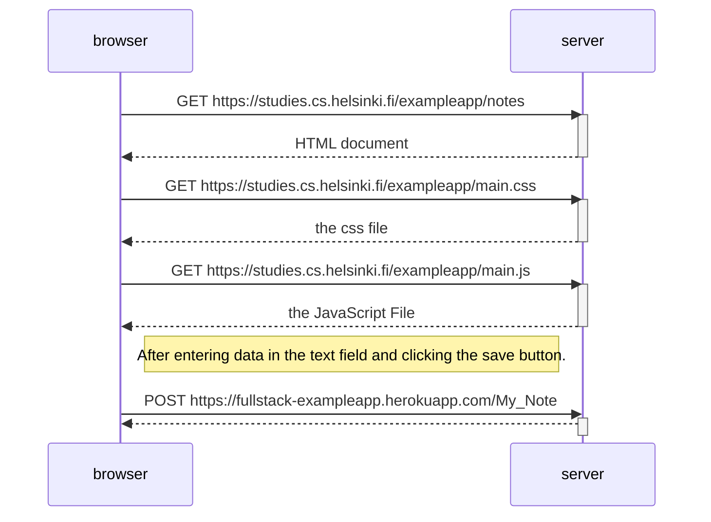

```mermaid

sequenceDiagram
    participant browser
    participant server

browser->>server: GET https://studies.cs.helsinki.fi/exampleapp/notes
activate server
server-->>browser: HTML document
deactivate server

browser->>server: GET https://studies.cs.helsinki.fi/exampleapp/main.css
activate server
server-->>browser: the css file
deactivate server

browser ->>server: GET https://studies.cs.helsinki.fi/exampleapp/main.js
activate server
server -->>browser: the JavaScript File
deactivate server

Note right of browser: After entering data in the text field and clicking the save button.


browser ->>server : POST https://fullstack-exampleapp.herokuapp.com/My_Note
activate server
server-->>browser:
deactivate server

```
